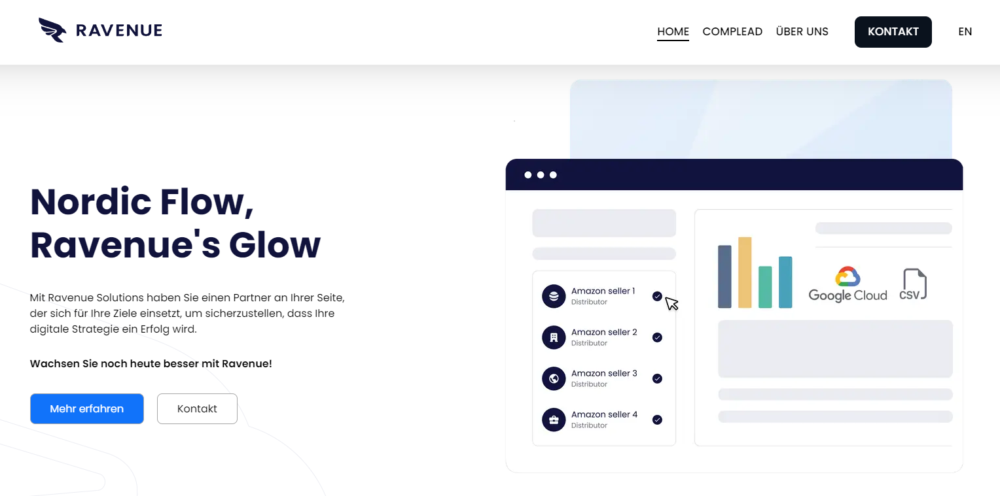

# Nordic-Ravenue-Solutions

`https://ravenue.de`

## Info
Im Vorfeld meines bevorstehenden fünften Semesters an der BFS Wedel, wo ich mich auf den Beruf des Informationstechnischen Assistenten mit Schwerpunkt Softwaretechnik vorbereite, hatte ich die Gelegenheit, ein bedeutendes schulisches Praktikum bei Nordic Ravenue Solution zu absolvieren. In diesem Rahmen war meine zentrale Aufgabe die Entwicklung der Unternehmenswebsite.

Die Umsetzung erfolgte dabei mit dem JavaScript-Framework Next.js, wobei das Front-End mithilfe von React und SCSS gestaltet wurde. Diese Technologien ermöglichten nicht nur eine effiziente und moderne Gestaltung, sondern auch eine benutzerfreundliche Interaktion auf der Website.

Es ist wichtig anzumerken, dass dieses Repository ausschließlich den Front-End-Code enthält, während der Backend-Code aus sicherheitsrelevanten Gründen nicht öffentlich einsehbar ist.

Dieses Praktikum hat mir nicht nur wertvolle Einblicke in die Anwendung moderner Webtechnologien verschafft, sondern auch meine praktischen Fähigkeiten in der Softwareentwicklung erheblich vertieft. Ich freue mich darauf, die während dieser Erfahrung erworbenen Kenntnisse in meinem weiteren Studium und in meiner beruflichen Laufbahn anzuwenden.

## Locale Installation

    git clone https://github.com/nmm-code/ravenue-solutions.git
#
    cd ravenue-solutions
#    
    npm install
#   
    npm run dev
#    
    http://localhost:3000 
#
